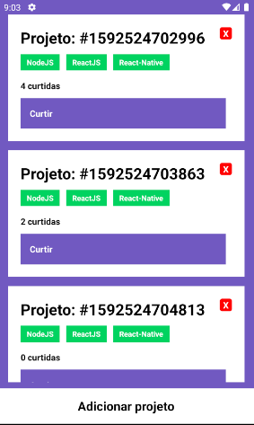

<h1>:open_file_folder: Challenge #4 - Basics React-Native - Rocketseat bootcamp GoStack</h1>

The purpose of this project is to complete the #4 Challenge of the Rocketseat GoStack 12 Bootcamp! 
https://github.com/Rocketseat/bootcamp-gostack-desafios/tree/master/desafio-conceitos-react-native

<h2>:computer: What is supposed to do?</h2>
This challenges consists in create a mobile front-end with React-Native integrated with a localhost API, capable of create, delete and like project entries on back-end, also it needed to pass in the following tasks:
<ul>
<li>Should add a like to the like counter of the repository;</li>
</ul>

<h2>:toolbox: What did I use?</h2>
<ul>
<li>Javascript;</li>
<li>React-Native;</li>
<li>JSX;</li>
<li>Axios;</li>
<li>API;</li>
</ul>
<small>The tests were provided by rocketseat staff!</small>

<h2>:man_technologist: Features</h2>
<ul>
<li>React-Native Structure;</li>
<li>useEffect() and useState();</li>
<li>async/await;</li>
<li>Integration with a external API;</li>
<li>map();</li>
<li>React-Native stylization</li>
</ul>

<h2>:heavy_check_mark: Check the solution</h2>
$ git clone https://github.com/victorfclima/basics-react-native.git
 
$ yarn
 
$ yarn test
 
$ yarn start
 
$ yarn android (if you have android emulator, like android studio)
 
You also need to run the back-end, located at: https://github.com/victorfclima/basics-nodejs
